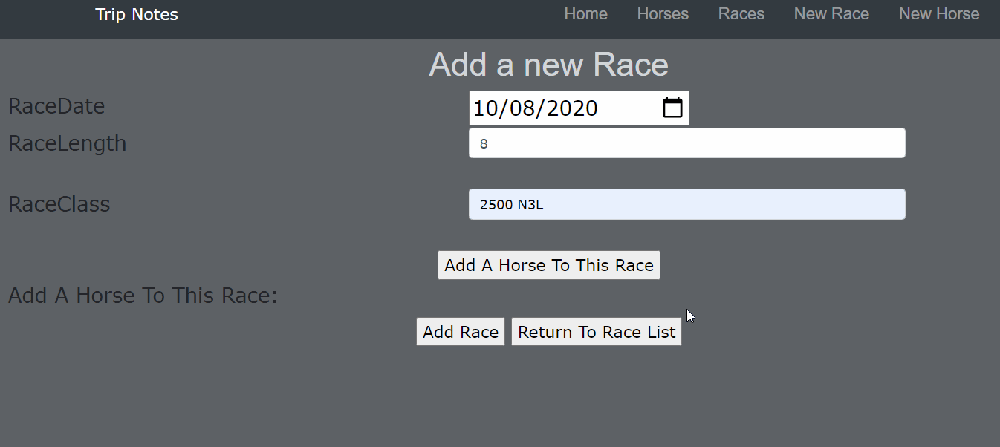
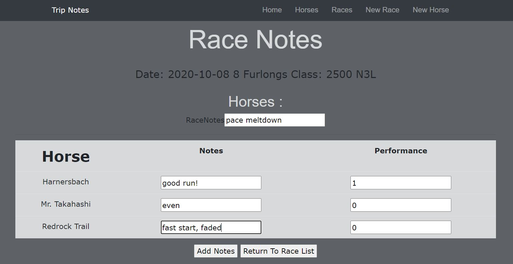
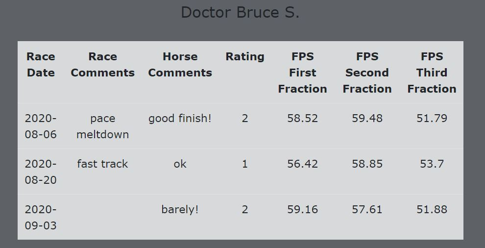
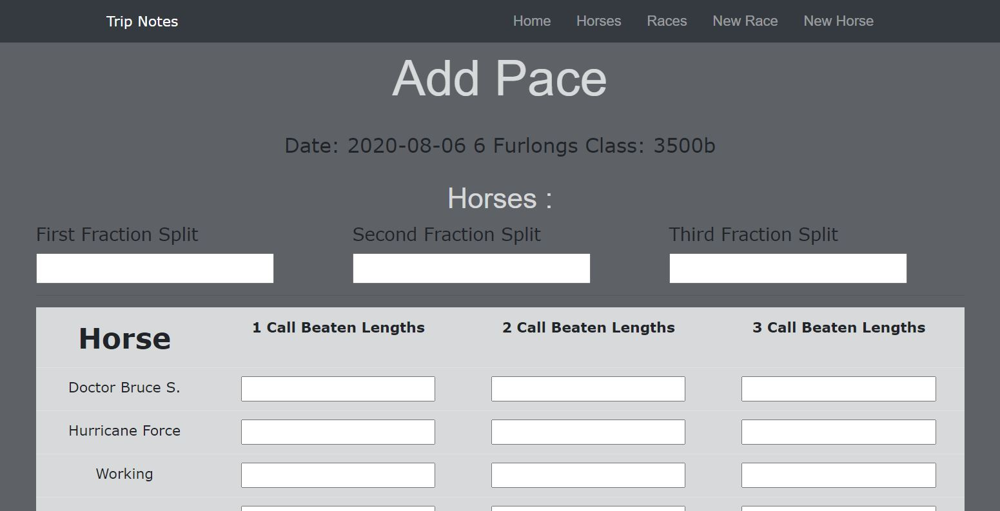
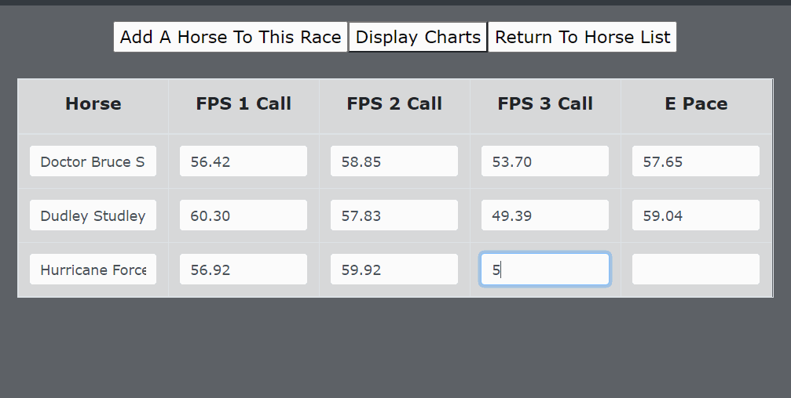

# <h1 align = "center"> TripNotes

## <h3 align = "center"> An App for Handicapping Enthusiasts

## <h2 align = "center"> About

 This application allows handicappers to save tripnotes for horses in a race and search those notes by horse. It also calculates Brohamer's Feet Per Second calculations and Early Pace.

## **✅REQUIREMENTS**
* Install [Git v2.62.2+](https://git-scm.com/downloads/)
* Install [.NET version 3.1 SDK v2.2+](https://dotnet.microsoft.com/download/dotnet-core/2.2)
* Install [Visual Studio Code](https://code.visualstudio.com/)
* Install [MySql Workbench](https://www.mysql.com/products/workbench/)

## **💻SETUP**
* to clone this content, copy the url provided by the green 'Code' button in GitHub
* in command line use the command 'git clone (GitHub url)'
* open the program in a code editor
* navigate to the TripNotes directory and type dotnet build in the command line to compile the code
* remaining in the TripNotes directory type dotnet ef database update to create the database
* type dotnet run in the command line to run the program

## **MVP**

- User can input horse names

- User can create a race by inputting race info and queuing up the horses that will run in that race

- User can make notes on the horses in the race

- User can look up all previous notes by horse

Creating the race

Adding notes for each horse in the race

Trip notes listed by race for each horse

## **Stretch Goals**
- program provides Tom Brohamer's pace calculations ✅
- program provides Tom Brohamer's Early Pace, Sustained Pace, Average Page, Factor X, and Energy Distribution Calculations
- dataset of Emerald Downs 2020 race season created with Pandas seeded in database
- charts for comparing pace calculations ✅ 

Pace Worksheet

Charts to compare pace figures

## 📫Support and contact details

Contact : Megan Hepner

## 🔧Technologies Used

* C#
* ASP.NET Core MVC
* Entity Framework
* MySql
* AJAX & JavaScript
* Charts.js

## **📘 License**
